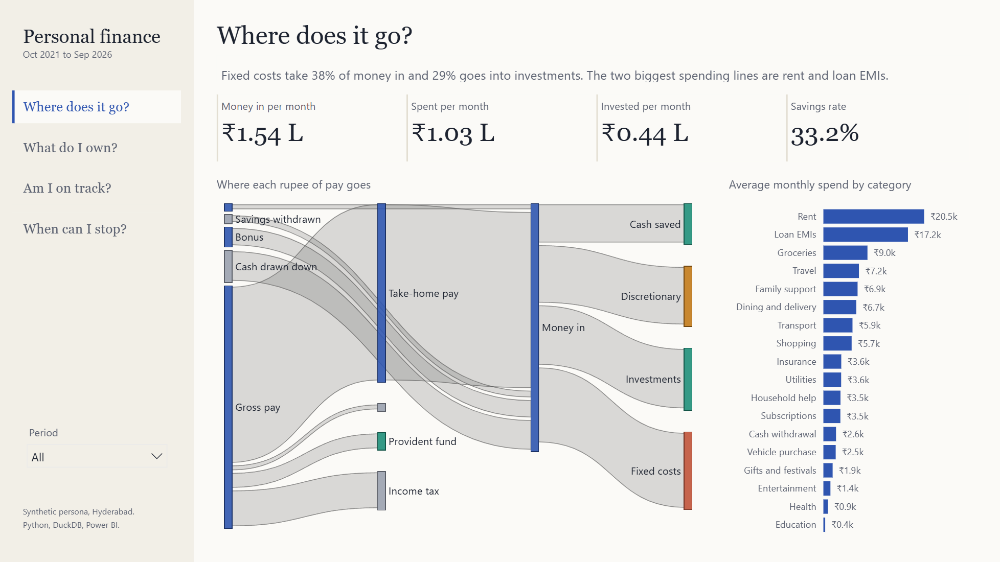

# Personal Finance BI

An end-to-end BI case study: five years of synthetic personal finance records for a software engineer in Hyderabad, modelled and tested in DuckDB, and presented as a four-question Power BI report.

**[Read the full case study (PDF)](docs/case-study.pdf)**, or the [web version](docs/case-study.html) for a portfolio site.
Reviewing the code? Start with **[How it works](docs/how-it-works.pdf)**, a stage-by-stage guide with the design choices worth challenging.



## What it answers

| Page | Question | Hero visual |
|---|---|---|
| 1 | Where does it go? | Sankey: gross pay through tax and EPF to fixed costs, discretionary, investments and cash |
| 2 | What do I own? | Assets by class over time, allocation at period end |
| 3 | Am I on track? | Savings rate (trailing 12 months), debt to income, emergency cover |
| 4 | When can I stop? | FIRE projection with live sliders for return, inflation and withdrawal rate |

## Headline findings (synthetic persona)

- Savings rate rose from 13.4% (FY 2021-22) to 40.9% (FY 2025-26).
- Net worth went negative once (−₹0.5 L, March 2023, car purchase) and reached ₹44.0 L by September 2026.
- Rent and loan EMIs take 36.6% of all spending.
- ₹7.7 L (17% of assets) sits in cash and FDs, about 7.5 months of spending.
- FIRE at age 46 on 10% return, 6% inflation and 3.5% withdrawal; 44 to 48 across reasonable assumptions.

## How it's built

```
src/generate.py          seeded generator: 10 raw exports (bank, card, payslips, funds, REIT, EPF, PPF, FD, loans)
config/                  categorisation rules (regex, priority) and category groups
sql/01_staging.sql       typed staging, one signed ledger
sql/02_model.sql         star schema, recursive loan amortisation, month-end holdings and liabilities
sql/03_marts.sql         monthly KPIs, net worth, Sankey flows, FIRE inputs and projection
sql/checks.sql           15 reconciliation checks; the export is blocked if any fails
src/pipeline.py          builds DuckDB, runs the checks, exports 13 tables to data/model
powerbi/build_pbip.py    generates the Power BI project (TMDL model + PBIR report) from the schema
powerbi/*.ps1            offline TMDL validation, DAX queries against Desktop, reload and capture helpers
```

Every number is checked twice: the SQL checks reconcile the data (bank balances, payslips, loan schedules, card bills, cashflow identity), and the Power BI measures were queried from the running model and matched to DuckDB exactly.

## Run it

Requirements: Python 3.12+, Power BI Desktop (Windows).

```bash
python -m venv .venv
.venv/Scripts/pip install -r requirements.txt
.venv/Scripts/python src/generate.py
.venv/Scripts/python src/pipeline.py
.venv/Scripts/python powerbi/build_pbip.py
```

Then open `powerbi/FinanceBI.pbip` in Power BI Desktop and select **Refresh**. `build_pbip.py` writes your local `data/model` path into the model's `DataFolder` parameter. The committed project points to `C:\personal-finance-bi\data\model\`, so a clone at `C:\personal-finance-bi` opens without rebuilding; anywhere else, rebuild or change `DataFolder` in Power Query.

The Sankey uses Microsoft's free [Sankey custom visual](https://github.com/microsoft/powerbi-visuals-sankey) from AppSource, which Power BI loads on first open.

## Data

All data is synthetic. Market prices are simulated and income tax is an approximation of India's new regime. No real personal data is used.
